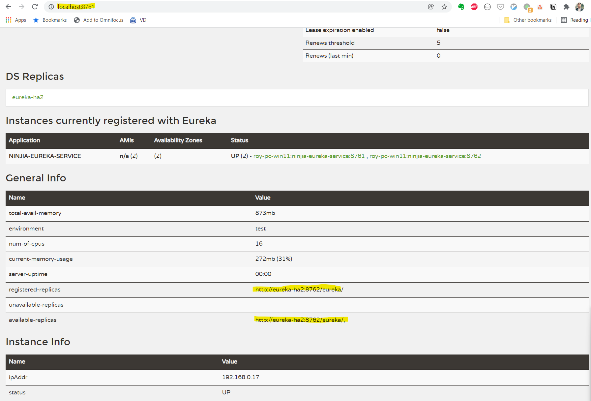

# Introduction

This is to demo how Eureka works as HA (Peer Awareness) mode.

## Quick start

To run the demo on your local machine, you need modify the `hosts` file to add below records.
```shell
127.0.0.1       eureka-ha1
127.0.0.1       eureka-ha2
```

Start the instance #1, open a terminal to execute below script.
```shell
./run-local-ha1.sh
```

Start the instance#2, open a terminal to execute below script.
```shell
./run-local-ha2.sh
```

Open browser to access http://localhost:8761 or http://localhost:8762, you will see the screen like below.



